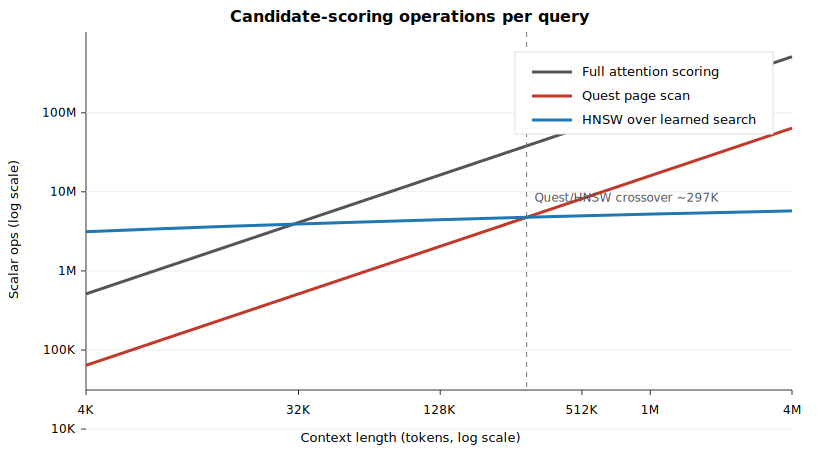

# ann-sparseattention

Train tiny per-layer "search projections" on a frozen LLM that replicate the
attention's top-K preferences in a low-dimensional space, so we can swap dense
quadratic attention for an off-the-shelf ANN index (FAISS HNSW) at inference
and lose almost no model quality.

## Current status

Research prototype. The trained projections work in a narrow 6-layer packed
WikiText-103 pilot on `Qwen/Qwen3-4B-Instruct-2507`, but the runtime is still
a correctness prototype. Treat reported numbers as preliminary until confidence
intervals, downstream long-context tasks, and real baselines are run.

Checkpoint artifacts and JSON eval outputs are mirrored on Hugging Face:
[`datasysdev/ann-sparseattention`](https://huggingface.co/datasysdev/ann-sparseattention).
Use `checkpoints_block_d128/search_step_1000.pt` there for the current clean
block-causal result.

**What's validated:**
- 6-layer packed pilot on Qwen3-4B-Instruct-2507, layers
  `[4, 8, 12, 16, 20, 24]`, 4K context, 1K training steps.
- `d_search=128` is the current recommended capacity from the packed capacity
  ablation: 3.93M trainable
  parameters, mass@K=128 of 0.503 vs 0.488 for the raw-QK exact-topK oracle,
  and -1.81% relative PPL gap at K=128 on the packed eval slice.
- Block-causal packed masking is implemented. On the clean block-causal d128
  rerun, exact sparse attention is near parity with full attention
  (K=128: +0.07% PPL gap; K=256: +0.01%). The large negative PPL gaps from
  packed-with-leakage do not survive as a clean-methodology headline.
- Capacity scaling is monotonic but saturating: d64 < d128 < d256 on mass@K,
  while d128 and d256 are effectively tied on final PPL.
- Learned projections outperform raw-QK oracle mass in mid/late trained layers
  (L12-L24), while early layers remain harder.

**Not yet validated (next iteration):**
- Confidence intervals for the block-causal result over multiple seeds and
  larger eval slices.
- Quest / RetrievalAttention baselines.
- Long-context task quality (LongBench, RULER, needle-in-haystack).
- 34-layer / whole-model substitution.
- Wall-clock speedup vs. FlashAttention/SDPA — not measured.
- KV-cache decode-mode integration.
- GPU-resident ANN or fused gather-attention kernel.

**Runtime caveat.** The current FAISS path is a correctness prototype: it
builds a CPU index per forward pass and uses dense-style tensor expansion
internally for the gather step. The compute-reduction numbers below are
**algorithmic scoring reductions, not measured wall-clock speedups.** A
production runtime requires a GPU-resident topk kernel or integration with
paged/block-sparse attention kernels.

### d_search ablation (packed WikiText-103, K=128)

The packed ablation trains the same 6 layers for 1K steps and evaluates all
variants with the same packed eval pipeline. `raw_qk` is exact top-K over
head-mean-aggregated native post-RoPE Q/K vectors; `learned` is exact top-K
over trained search projections. mass@K is teacher-attention probability
captured by the retrieved set.

| d_search | Params | learned mass@K=128 | raw-QK oracle | learned / oracle | Final PPL gap |
|---|---:|---:|---:|---:|---:|
| 64 | 1.97M | 0.492 | 0.488 | 1.01x | +2.39% |
| **128** | **3.93M** | **0.503** | **0.488** | **1.03x** | **-1.81%** |
| 256 | 7.86M | 0.509 | 0.488 | 1.04x | -1.85% |

d128 is the recommended default for this pilot: it captures almost all of the
d256 quality with half the trainable parameters. d256 improves mass@K slightly
but does not materially improve final PPL.

PPL gap is the primary model-quality signal; mass@K is the more direct
retrieval-quality signal when teacher attention is sharp. Recall@K is logged,
but it is a weaker proxy because disagreement on near-zero-probability tail
positions can look like low recall while preserving model output.

Per-layer mass@K=128 for d128:

| Layer | raw-QK oracle | learned d128 |
|---|---:|---:|
| 4 | 0.422 | 0.382 |
| 8 | 0.518 | 0.421 |
| 12 | 0.404 | 0.533 |
| 16 | 0.475 | 0.481 |
| 20 | 0.499 | 0.551 |
| 24 | 0.614 | 0.648 |

Early layers remain harder for learned retrieval; mid/late trained layers
exceed raw-QK oracle mass.

### K-retrieve Pareto (packed d128, leakage-confounded)

Exact top-K sweep for the recommended packed d128 checkpoint:

```bash
python k_sweep.py \
  --ckpt /tmp/checkpoints_packed_d128/search_step_1000.pt \
  --K 128,256,512 \
  --no-use-faiss
```

`PPL_full = 224.64` on this packed eval slice.

| K | Recall@K | mass@K | PPL_ANN | PPL gap |
|---|---:|---:|---:|---:|
| 128 | 0.166 | 0.256 | 203.63 | -9.36% |
| 256 | 0.233 | 0.318 | 207.06 | -7.83% |
| 512 | 0.339 | 0.409 | 211.93 | -5.66% |

This disambiguates the earlier FAISS high-K failure on the leaked packed
pipeline: exact retrieval remains
strongly negative at K=256/512, so the denoising pattern is present on this
packed eval slice. This should not be used as a publication-strength denoising
claim because packed examples can attend across document boundaries.

A second exact sweep on the next 16 packed eval batches (`--skip-batches 16`)
preserved the shape: K=128 -8.78%, K=256 -7.59%, K=512 -6.21%. This is still
not a substitute for confidence intervals, but it reduces the chance that the
large negative gap is a single-slice accident.

### Block-causal packed d128 (clean masking)

Packed block-causal masking assigns each packed document a `segment_id`, resets
`position_ids` at segment boundaries, and supplies a 4D additive mask so tokens
can only attend causally within their own document. Retrieval, loss masking,
mass@K, and recall@K use the same segment-causal eligibility mask.

Clean d128 block-causal run:

```bash
python train.py --config pilot_d128_block
python k_sweep.py \
  --ckpt /tmp/checkpoints_block_d128/search_step_1000.pt \
  --K 128,256,512 \
  --no-use-faiss
```

`PPL_full = 30.44` on the 16-batch clean eval slice.

| K | Recall@K | mass@K | PPL_ANN | PPL gap |
|---|---:|---:|---:|---:|
| 128 | 0.744 | 0.787 | 30.47 | +0.07% |
| 256 | 0.879 | 0.953 | 30.45 | +0.01% |
| 512 | n/a | n/a | 30.45 | +0.01% |

K=512 has no meaningful mass/recall average on this WikiText slice because
almost no same-segment queries have 512 valid causal keys. The quality result
is still useful: with filler slots masked out of the sparse-attention softmax,
the block-causal exact path is effectively at full-attention parity. The clean
result supports "quality-preserving sparse substitution" rather than the leaked
pipeline's stronger denoising claim.

Clean block-causal per-layer `compare_retrieval` at K=128:

| Layer | raw-QK oracle mass | learned d128 mass |
|---|---:|---:|
| 4 | 0.956 | 0.950 |
| 8 | 0.977 | 0.976 |
| 12 | 0.970 | 0.977 |
| 16 | 0.964 | 0.970 |
| 20 | 0.970 | 0.983 |
| 24 | 0.978 | 0.984 |
| avg | 0.969 | 0.973 |

This changes the per-layer interpretation from the leakage-confounded pilot:
with segment isolation, early trained layers are not diffuse or uniquely hard.
All six trained layers have high oracle mass, and learned projections match or
slightly exceed raw-QK retrieval across the set. The deployment hypothesis for
the next run is therefore "substitute all tested layers" rather than "keep early
layers as full attention," pending a broader all-layer run.

### Quest-style page baseline (clean block-causal)

`quest_sweep.py` implements a Quest-style min/max page selector for comparison:
page size 16, native post-RoPE Q/K, same block-causal token eligibility mask,
and the same sparse-attention gather path. This is a correctness baseline, not
an optimized Quest runtime.

```bash
python quest_sweep.py \
  --ckpt /tmp/checkpoints_block_d128/search_step_1000.pt \
  --K 128,256,512 \
  --page-size 16
```

On the same 16-batch block-causal eval slice:

| Method | K | Recall@K | mass@K | PPL | PPL gap |
|---|---:|---:|---:|---:|---:|
| learned search exact | 128 | 0.744 | 0.787 | 30.47 | +0.07% |
| Quest-style page | 128 | 0.669 | 0.727 | 30.41 | -0.11% |
| learned search exact | 256 | 0.879 | 0.953 | 30.45 | +0.01% |
| Quest-style page | 256 | 0.838 | 0.909 | 30.45 | +0.03% |

Both methods are effectively full-attention parity on PPL. The learned search
space recovers more teacher attention mass at the same token budget, especially
at K=128, while Quest remains a strong non-trained heuristic baseline. This
keeps the contribution narrow: learned projections improve retrieval fidelity
and support standard ANN indexing; they do not yet show a clean PPL advantage
over Quest on this slice.

Paired 32-batch NLL evaluation gives a sharper comparison:

| K | full PPL | learned PPL | Quest PPL | learned - Quest NLL delta (95% bootstrap CI) | Read |
|---|---:|---:|---:|---:|---|
| 128 | 28.03 | 28.07 | 28.01 | +0.00205 `[+0.00160, +0.00251]` | Quest slightly better |
| 256 | 28.03 | 28.04 | 28.04 | -0.00005 `[-0.00029, +0.00018]` | statistical tie |

So the current clean result is: learned search has higher teacher-attention
mass, but PPL is either tied with Quest (K=256) or slightly worse (K=128) on
this paired WikiText slice. The paper claim should be "retrieval-fidelity and
ANN-compatibility advantages," not "PPL advantage over Quest."

### Clean FAISS-vs-exact check

The first block-causal FAISS prototype used one global index followed by
segment filtering, which produced pathological filler rates after filtering.
The current FAISS path builds per-segment indexes when a 4D block-causal mask
is present. With that fix, CPU FAISS/HNSW tracks exact learned search on the
same 16-batch clean eval slice:

| Method | K | PPL | PPL gap | FAISS filler rate |
|---|---:|---:|---:|---:|
| learned exact | 128 | 30.47 | +0.07% | n/a |
| learned FAISS/HNSW | 128 | 30.47 | +0.09% | 0.447 |
| learned exact | 256 | 30.45 | +0.01% | n/a |
| learned FAISS/HNSW | 256 | 30.46 | +0.04% | 0.683 |

The remaining filler rate is expected for short same-segment prefixes where
fewer than K valid causal keys exist; filler slots are masked out of the sparse
attention softmax. This demonstrates off-the-shelf ANN compatibility in the
clean block-causal setting, but not production wall-clock speedup.

### Asymptotic scoring analysis

`artifacts/scaling_analysis.md` gives a deterministic operation-count proxy
for the per-query candidate scoring step. This is the cost of identifying
which keys to attend to, before the sparse attention softmax and value
multiply over the selected keys.

Assumptions:

- Full attention scoring: `N * d_head = N * 128`.
- Quest-style page scoring: `(N / page_size) * 2 * d_head = N * 16`
  with `page_size=16`.
- Learned HNSW scoring: `M * ef_search * log2(N) * d_search`
  with `M=32`, `ef_search=64`, and `d_search=128`.



| Context | Full ops/query | Quest ops/query | Learned HNSW ops/query | Quest / learned |
|---:|---:|---:|---:|---:|
| 4K | 512,000 | 64,000 | 3,136,759 | 0.02x |
| 8K | 1,024,000 | 128,000 | 3,398,903 | 0.04x |
| 16K | 2,048,000 | 256,000 | 3,661,047 | 0.07x |
| 32K | 4,096,000 | 512,000 | 3,923,191 | 0.13x |
| 64K | 8,192,000 | 1,024,000 | 4,185,335 | 0.24x |
| 128K | 16,384,000 | 2,048,000 | 4,447,479 | 0.46x |
| 256K | 32,768,000 | 4,096,000 | 4,709,623 | 0.87x |
| 512K | 65,536,000 | 8,192,000 | 4,971,767 | 1.65x |
| 1M | 128,000,000 | 16,000,000 | 5,224,942 | 3.06x |
| 2M | 256,000,000 | 32,000,000 | 5,487,086 | 5.83x |
| 4M | 512,000,000 | 64,000,000 | 5,749,230 | 11.13x |

Under these conservative HNSW constants, Quest is cheaper below the
few-hundred-thousand-token regime and learned-projection scoring becomes
cheaper beyond roughly 300K tokens. At 1M context, the operation-count proxy is
about 3x in favor of learned projections. This supports the theoretical
scaling claim only; production speed claims still require GPU-resident
retrieval and KV-cache/decode integration.

### Dynamic-index proxy

The current ANN wrapper is prefill-only (`use_cache=False`), so a true
generation-time dynamic-index benchmark still requires cache integration. As a
first capability proxy, `dynamic_index_proxy.py` splits clean block-causal eval
sequences into a prefill prefix and decode-like suffix, then compares learned
retrieval mass under two masks:

- dynamic index: suffix queries can retrieve from all same-segment prior keys;
- static index: suffix queries can retrieve from prefill keys plus a 256-token
  recent local suffix window, but not older suffix keys.

On the clean d128 block-causal checkpoint, using K=128, prefill length 1024,
local window 256, and 8 eval batches:

| Setting | Teacher mass captured |
|---|---:|
| Dynamic proxy | 0.972 |
| Static proxy | 0.928 |
| Static teacher mass available | 0.954 |
| Dynamic - static | +0.044 |

Per-layer dynamic-minus-static mass ranges from +0.022 (L04) to +0.058 (L08).
This does not establish task accuracy or decode latency, but it shows that a
frozen prefill-plus-local index loses measurable teacher-attention mass on
decode-like suffix queries. The raw result is in
`artifacts/dynamic_proxy_8b.json`.

### Compute / quality knobs (FLOP-counted)

`L = 4096`. Compute reduction is the attention scoring step, `≈ L / K`.
These are FLOP estimates, not measured wall-clock — the FAISS path in this
repo is a research prototype that does CPU index builds and GPU↔CPU
transfers, so it is not the right thing to time. A GPU-resident topk
kernel is the natural next step.

| K | PPL gap | Attention scoring reduction |
|---|---|---|
| 512 | -5.66% (exact top-K over learned search space) | ~8x |
| 256 | -7.83% (exact top-K over learned search space) | ~16x |
| 128 | -9.36% exact; -1.81% FAISS/training eval | ~32x |
| 64 | +0.46% | ~64x |
| 32 | +0.03% | ~128x |
| 16 | +5.63% | ~256x |

Eval scope for the d_search table: 16 packed validation batches at 4K context
for PPL/recall during training, and 12 packed batches for `compare_retrieval`
mass@K. Numbers should be read as "what we observed on this slice", not
population-level estimates.

### Caveats / what's next

A few things the pilot does not yet establish, and that the next iteration
will:

- **Packing**: the d_search ablation table is still from the packed
  leakage-confounded run and is best read as a capacity comparison. The clean
  block-causal d128 rerun removes cross-document leakage and should be used for
  quality claims.
- **Exact-topK oracle**: the obvious follow-up is a four-way Pareto —
  full attention vs. exact top-K (true `QK^T` argmax-K, then attention) vs.
  search-topK (our projections, exact distance) vs. search-ANN (FAISS HNSW).
  That separates "denoising from any sparsity" from "denoising from learned
  projections."
- **Wall-clock**: the compute-reduction table above is FLOP-counted. The
  FAISS path here is a research prototype (CPU index per forward, GPU↔CPU
  transfer) and is the wrong thing to time. A GPU-resident topk kernel is
  the next-step engineering.
- **34-layer headline**: was queued and the VM was reclaimed before launch.
  Config is wired (`make_headline_config()`); rerun is a single command on
  any B200/H100/H200.

The recall@K and mass@K reported here come from a 12-batch eval slice, not
a population-level estimate. Confidence intervals and downstream tasks
(LongBench / RULER / needle-in-haystack) are the natural next evals.

### Headline run (queued)

34 layers (every layer except 0 and 35), 8K context, 6K steps,
~4-5h on a single B200. Tests whether the technique generalizes from a
6-layer subset to broad layer coverage. Checkpoints will be mirrored at
[`datasysdev/ann-sparseattention`](https://huggingface.co/datasysdev/ann-sparseattention).

## Relation to RetrievalAttention

The closest prior work is RetrievalAttention (Liu et al., 2024). They show
that **vanilla ANN over the model's native Q and K vectors fails** because
Q and K live in mismatched distributions — they were never trained to be
each other's nearest neighbors, only to score correctly via the dot
product. Their fix is at *index time*: an attention-aware graph
construction (RoarGraph-style) that compensates for the Q/K out-of-
distribution problem at search time.

This work attacks the same problem from the opposite direction. Instead of
patching the index over hostile vectors, we **train a tiny shared
low-dimensional projection** (`W_Qs, W_Ks → R^128` in the recommended pilot)
so that `q_search` and `k_search` *do* live in the same distribution by construction. Off-the-
shelf FAISS HNSW with default parameters is then sufficient — there is no
attention-aware index trick.

| | Search space | Index | Trainable |
|---|---|---|---|
| Raw Q/K + vanilla ANN | original Q/K | off-the-shelf | no — fails (Q/K OOD) |
| RetrievalAttention | original Q/K | attention-aware graph | no |
| **This work** | **learned Q\_s / K\_s** | **off-the-shelf** | **yes (~2-11M params)** |

The contribution claim: *eliminate the Q/K mismatch at index-build time
via distillation, instead of patching it at search time.* The clean
experiment to validate this — vanilla FAISS over raw Q/K vs. vanilla
FAISS over learned Q\_s/K\_s vs. exact teacher top-K, all at the same K —
is the next planned run. The current pilot establishes that the learned
projections retrieve attention-relevant keys; the comparison run isolates
how much of that came from the projection vs. the ANN approximation.

## How it works

For each full-attention layer `i` we train two linear projections
`W_Qs^i, W_Ks^i ∈ R^{d_model × d_search}` (recommended pilot: d_search=128),
so that for any
hidden state `h`,

```
q_search = W_Qs^i h        k_search = W_Ks^i h
softmax(q_search · k_search^T)  ranks the same keys as
softmax(QK^T / √d_head)         (the teacher's attention)
```

Two losses, summed across layers:

- **InfoNCE** with teacher-derived positives (top-`K_pos` keys from the
  teacher's attention serve as positives for each query).
- **KL(teacher ‖ student)** on the full attention distribution.

At inference, we monkey-patch each trained layer's attention forward to:

1. Compute `q_search`, `k_search` from the same hidden state.
2. Build a per-batch FAISS HNSW index over `k_search` (default params).
3. Retrieve top-`K_retrieve` positions (causal-respecting) per query.
4. Run standard attention restricted to those `K_retrieve` keys.

The base model's parameters are never touched. The recommended d128 pilot
trains 3.93M parameters total.

## Repo layout

```
config.py        Run config (pilot defaults; make_headline_config() for follow-up)
model.py         SearchProjection, FrozenForwardCapture (with QK reconstruction
                 trick: capture (Q, K) post-RoPE while the forward stays in FA),
                 contrastive + KL distillation losses
data.py          Long-context dataloader (packing off by default to avoid
                 cross-segment attention leakage; pin_memory, prefetch)
inference.py     ANN-substituted attention (exact top-K for analysis;
                 CPU-FAISS HNSW prototype path — not a deployable kernel)
eval.py          recall@K curve, mass@K curve, full-vs-ANN PPL,
                 MoE router stability
train.py         Training loop, Liger setup, FA-3→FA-2→SDPA→eager fallback,
                 base-model freeze + drift check, auto-resume from latest ckpt
tests/           QK reconstruction verification + 50-step smoke test
```

## Quick start

```bash
pip install -r requirements.txt
export WANDB_API_KEY=<key>      # only — never check it in
export HF_TOKEN=<token>         # for faster Hub downloads

# Pre-launch checks
python -c "from transformers import AutoConfig; \
print(AutoConfig.from_pretrained('Qwen/Qwen3-4B-Instruct-2507'))"
python tests/test_qk_reconstruction.py
python tests/smoke_test.py

# Packed d_search ablation
bash scripts/run_packed_ablation.sh

# Default clean pilot (packing off; data-sparse on WikiText articles)
python train.py --config pilot_d64_clean
```

## Configuration

The default `Config` is the 1-day pilot:

| Knob | Pilot | Headline |
|---|---|---|
| `seq_len` | 4096 | 8192 |
| `batch_size` | 8 | 8 |
| `total_steps` | 1000 | 6000 |
| layers trained | 6 (`[4,8,12,16,20,24]`) | 34 (`range(36)` minus reserved `[0, 35]`) |
| trainable params | 1.97M at d64; 3.93M at d128 | 11.1M at d64 |
| `d_search` | 64 default; d128 recommended from ablation | 64 default |
| `K_retrieve_eval` | 128 | 128 |

Pilot is the proof-of-concept; headline trains every attention layer except
the first (raw-embedding-adjacent) and last (output-logits-adjacent), which is
the deployment-relevant claim that the technique scales to dense application.

Use `make_pilot_d128_packed_config()` to reproduce the current recommended
pilot, or `make_headline_config()` for the broader 34-layer run.

## Performance choices

- `attn_implementation` resolves at load time as
  `flash_attention_3 → flash_attention_2 → sdpa → eager`. On B200 with no
  flash-attn package installed, SDPA wins — its built-in flash backend is
  ~80-90% of FA-2's throughput with zero build dependency.
- Liger kernels applied via `apply_liger_kernel_to_qwen3` (RMSNorm, SwiGLU,
  RoPE fused — typically 30-50% faster forward).
- The QK-reconstruction trick keeps SDPA/FA fast on the trained layers:
  we monkey-patch them to capture `(Q, K)` post-RoPE, then reconstruct
  `softmax(QK^T/√d)` ourselves *after* the forward returns. The forward
  never sets `output_attentions=True` (which would force eager).
- `torch.compile(search_module, mode="max-autotune")` on the search
  projections; base model uncompiled (works but flaky for novel architectures).
- bf16 throughout; loss math cast to fp32 for numerical stability of softmax.

## Verifying the QK reconstruction

The post-RoPE Q/K capture must match what the model's eager attention computes
or distillation supervision is wrong. The test asserts top-32 agreement
> 99% per layer:

```bash
python tests/test_qk_reconstruction.py --model Qwen/Qwen3-4B-Instruct-2507
# layer 0: PASS  max|Δ|=2.54e-02  top-32 agree=0.9963
# layer 1: PASS  max|Δ|=5.27e-02  top-32 agree=0.9941
# ...
# QK reconstruction verified.
```

The bf16 max-abs differences (~0.05) are just numerical noise; the
*ranking* of attention positions matches.

## Reproducing the pilot

```bash
git clone git@github.com:unixsysdev/ann-sparseattention.git
cd ann-sparseattention
pip install -r requirements.txt
python train.py --config pilot_d128_packed
```

A single H100/H200/B200 + 8GB GPU RAM for the 4B model + ~10GB for activations
at 4K context, batch 8.

## License

MIT.
